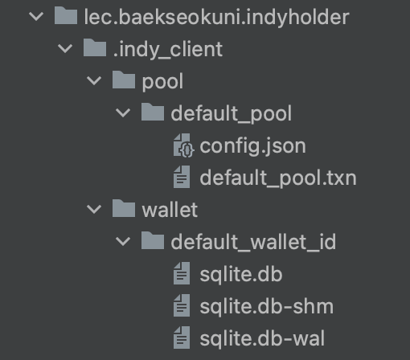

# DID 응용 개발 프로젝트
hyperledger 기반의 SSI(Self-Sovereign-Identity) holder 만들기 실습

### 준비 사항
- [Android Studio Flamingo](https://developer.android.com/studio): 안드로이드 개발 도구
  - Android 11.0 이상 단말 (virtual 가능)
- [GitHub](https://github.com/): 형상(소스) 관리 도구
  - [Git 이란?](https://git-scm.com/)
    소스 코드의 버전을 분산 형식으로 저장, 관리하는 도구
  - repository: 소스 저장소. 원격(remote), 로컬(local) 존재
    - [indy-holder](https://github.com/bdgen/indy-holder)
- 공유 가능한 slide, spread sheet, word 툴
  - 각종 명세 문서를 작성 하기 위한 문서 도구
    ex) MS-office, Google Docs, [PlantUML](https://plantuml.com/ko/) 등

### repository 생성
초기 repository인 [indy-holder](https://github.com/bdgen/indy-holder) 중 practice branch를 check-out 한 후 해당 브랜치의 소스를 받아 새 repository에 import합니다.

### 학습 목표
- DID 개념을 이해하고 DID를 이용한 holder 앱을 설계, 구현할 수 있다.
- JAVA 언어를 사용하여 안드로이드 앱을 개발할 수 있다.
- git의 개념을 이해하고 협업하여 소스를 관리할 수 있다.
- 기획, 셜계 및 구현 사항에 대한 명세 문서를 작성할 수 있다.

### project, workspace setting
clone한 repository에 아래 세팅이 되어 있는지 확인합니다.
- build.gradle
  - 언어: Kotlin 1.8.0 또는 java 8
  - 빌드 툴: AGP(Android Gradle Plugin) 8.0.2
- build.gradle(:app)
  - minSdk: 30 (android 11) 이상
  - targetSdk: 33 (최신 버전)
  - compile 언어: java 8
- [hyperledger indy-sdk](https://github.com/hyperledger/indy-sdk) 내 indy library import
  - libindy.so
  - libindy_shared.so
  - libc++_shared.so
  - libjnidispatch.so

### project structure
- /app/libs: 프로젝트에서 사용하는 library 파일을 직접 import. [build.gradle](app/build.gradle) 파일에 dependency 추가한 library는 External Libraries에 추가 된다.
- /app/src/main/java: 앱을 구동하기 위한 소스를 작업하는 directory.
- /app/src/main/jniLibs: indy library를 import. 각 CPU architecture 별 libindy 라이브러리(~.so)를 import한다.
- /app/src/main/res: UI 구성을 위한 각종 정적 resource 파일 directory

### indy client directory structure


### 
sdk API
##### issue
1. credential offer: 발급을 위한 제안 (entry point)
2. credReq 생성: credential 발급을 위한 metaData 등의 요청 정보를 생성
```
Anoncreds.proverCreateCredentialReq(wallet, did, credOffer, credDefJson, masterSecret)
```
##### credential
3. credential 저장
```
Anoncreds.proverStoreCredential(wallet, @Nullable credId, credReqMetadataJson, credJson, credDefJson, @Nullable revRegDefJson)
```
5. 저장한 credential 조회
- filter를 이용하여 다 건 조회 (@Deprecated)
```
String filterJson = 
{
  "schema_id": string,
  "schema_name": Optional<string>,
  "schema_version": Optional<string>,
  "cred_def_id": Optional<string>
}
Anoncreds.proverGetCredentials(wallet, filterJson)
```
- credId를 이용하여 단 건 조회
```
Anoncreds.proverGetCredential(wallet, credId)
```
6. credential 삭제
```
Anoncreds.proverDeleteCredential(wallet, credId)
```

###
issuer API
- issuer domain
  baseUrl = "http://211.37.24.246:8080/"
- [swaggerUI(API 명세)](http://211.37.24.246:8080/webjars/swagger-ui/index.html)

### credential data structure
```
credentials json =
[{
   "referent": string,
   "attrs": {"key1":"raw_value1", "key2":"raw_value2"},
   "schema_id": string,
   "cred_def_id": string,
   "rev_reg_id": Optional<string>, - identifier of revocation registry definition
   "cred_rev_id": Optional<string> - identifier of credential in the revocation registry definition
}]
```
referent: credential Id </br>
attrs: credential attributes </br>
schema_id: schema Id </br>
cred_def_id: credential definition id </br>
</br>
rev_reg_id: identifier of revocation registry definition </br>
cred_rev_id: identifier of credential in the revocation registry definition </br>
